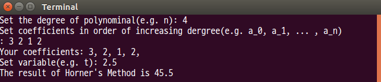

## 1. Explain the property of linear independence and linear combination.

> Definition of linear independence

$$
\text{The polynomials ,\{} \varPhi_0(t),\, \varPhi_1(t),\, \dotsc , \varPhi_n(t) \text{\}, are said to be } \textit{linearly independent,}\\
\text{if the resultant of their }\textit{linear combination}\text{ is zero can only be satisfied by choosing all of coefficients zero.}
$$
$$
\text{s.t. } a_0\varPhi_0(t) + a_1\varPhi_1(t) + a_2\varPhi_2(t) + \dotsb + a_n\varPhi_n(t) = 0 \Rightarrow a_0 = a_1 = \dotsb = a_n = 0 \\
$$

즉, 선형 독립이 아니라면, 0이 아닌 계수가 존재하고, 하나의 다항식을 다른 다항식의 중첩(superposition[^1])으로 표현이 가능하다는 것을 뜻한다. 따라서 이러한 1차 결합(선형 독립하지 않은 1차 결합)은 기저가 될 수 없다.

$$
\varPhi_0(t) = \frac{-a_1}{a_0}\varPhi_0(t) + \frac{-a_2}{a_0}\varPhi_2(t) + \dotsb + \frac{-a_n}{a_0}\varPhi_n(t)
$$

> Definition of linear combination

$$
\text{The } \textit{linear combination} \text{ of those polynomials with those complex numbers as coefficients is} \\
a_0\varPhi_0(t) + a_1\varPhi_1(t) + a_2\varPhi_2(t) + \dotsb + a_n\varPhi_n(t)
$$

1차 결합은 각 항의 덧셈과 상수의 곱셈으로만 표현된 식을 의미한다.

[^1]:
$$
F(\alpha x_1 + \beta x_2) = \alpha F(x_1) + \beta F(x_2) \quad \textbf{Superposition}
$$
$$
\begin{bmatrix}
F(x_1 + x_2) = F(x_1) + F(x_2) & \textbf{Additivity} \\
F(\alpha x) = \alpha F(x) & \textbf{Homogeneity}
\end{bmatrix}
$$

<div style="page-break-after: always;"></div>

## 2. Write a C(or C++) code for Horner's method for degree $n$ polynomial. Execute the program and show an example using a real numbers.

```c++ {.line-numbers}
#include <iostream>

template<typename iter_Container>
 double Horner( iter_Container begin_Coefficient /* a_0 (the address of first coefficient) */,
                iter_Container end_Coefficient   /* a_n (the address of the container) */,
                double t                         /* independent variable */)
{
  double result_Polynomial = 0;
  while (end_Coefficient != begin_Coefficient) {
    result_Polynomial = result_Polynomial * t + *(--end_Coefficient);
  }
  return result_Polynomial;
}

int main()
{
  int degree_Polynomial = 0;
  std::cout << "Set the degree of polynomial(e.g. n): ";
  std::cin >>  degree_Polynomial;

  float* pCoefficients = new float[degree_Polynomial];
  std::cout << "Set coefficients in order of increasing degree(e.g. a_0, a_1, ... , a_n)\n: ";
  for(auto ii = 0; ii < degree_Polynomial; ii++) {
    std::cin >> pCoefficients[ii];
  }
  std::cout << "Your coefficients: ";
  for(auto ii = 0; ii < degree_Polynomial; ii++) {
    std::cout << pCoefficients[ii] << ", ";
  }
  std::cout << "\n";

  float variable = 0;
  std::cout << "Set variable(e.g. t): ";
  std::cin >> variable;
  std::cout << "The result of Horner's Method is "
            << Horner(pCoefficients, pCoefficients + n, variable)
            << std::endl;
  delete[] pCoefficients;
}
```



<div style="page-break-after: always;"></div>

## 3. Do the following 2 equations have the same roots? $$ a(t) = 2 - 3t + t^2 \\ b(t) = t^3 - t^2 $$

`Resultant = 0` 식을 이용한다.

$$
a(\tau) = b(\tau) = 0 \\
$$

$$
a(\tau) = (\tau - 1)(\tau - 2) = 0 \\
\therefore \tau = 1, \; \tau = 2
$$

$$
b(\tau) = \tau^2(\tau - 1) = 0 \\
\therefore \tau = 0, \; \tau = 1
$$

$a(1) = b(1) = 0$ 이므로, 공통근($t = 1$)을 가진다. $\Box$
